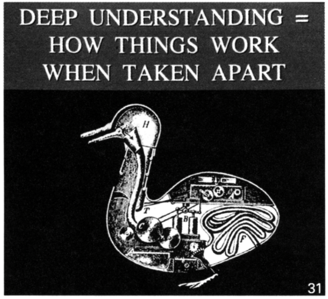

# Course Introduction {-}

**Every research, product, or policy question that is interesting is actually a causal question.** 

- Do messages that are targeted to low-propensity voters cause them to turnout? (Nope!)
- Can cellphone trace data be used to successfully target aid to the world's poorest? [[link](https://www.science.org/doi/full/10.1126/science.aac4420)]
- Does the changing climate have an impact on our wellbeing? [[link](https://www.nature.com/articles/s41558-025-02407-w.epdf?sharing_token=1R7i7HQmZSSn5RoBQL9BcdRgN0jAjWel9jnR3ZoTv0NQU4QOz585FcTVcOtuamxH0qqRjWiYywlQS6ZiO9b7jdJXSD1HHqWa-qrk7ifWBIwQ_TxVIAiaipbCTGZSPUBF-wWr1cDcazGusjFvcS5LgbGhLS7jJ-d-oNOTa-W7VJs%3D)], [[link](https://www.science.org/doi/full/10.1126/sciadv.1601555)]
- Can design improve lives? [[link](https://www.whitehouse.gov/presidential-actions/2025/08/improving-our-nation-through-better-design/)] 
- What do people like in the design of a house? 
- Does increasing login pressure increase compliance with cybersecurity training? 
- Does {this} product feature affect {that} KPI? 

**Deep understanding is knowing how things work when they are taken apart.** 

## Core Questions 

This course is about designing experiments that we run in the *real-world*. 

- What is the value of making a causal statement? 
- Why do we conduct experiments?
- This is a modern academic program -- we've got, you know, LLMs and stuff... With enough data and a savvy enough model, can't we just generate a causal statement that will be right? Can't I generate a statement that converges in probability to the *correct* value?

## Learning Objectives 

At the end of this conversation, students will be able to

1. *Gain Access* to bCourses. 
2. *Understand* the course goals, and access course assessments 
3. *Understand* the course learning model
4. *Evaluate* an experiment they have run for themselves. 

## Student Introductions [Breakout One]

In a breakout room of between three and four students introduce yourself! 

::: {.breakout data-latex=""}
**Breakout One.** A *name story* is the unique, and individual story that describes how you came to have the name that you do. While there may be many people are called the same thing, each of their name stories is unique. 

Please share: *What is your name story?*
:::

## Student Introductions [Breakout Two] 

In the same breakout room: 

::: {.breakout data-latex=""}
**Breakout Two.**
Like our names, the reasons that we joined this program, our goals and our histories are different. 

Please share: *What is your data science story? How did you wind up here, in this room today?* 
:::

## Course Plan 

The course is built out into three distinct phases

- **Part 1** Develops causal theory, potential outcomes, and a permutation-based uncertainty measurement
- **Part 2** Further develops the idea of a treatment effect, and teaches how the careful  design of experiments can improve the efficiency, and easy of analysis
- **Part 3** Presents practical considerations when conducting an experiment, including problems that may arise, and how to design an experiment in anticipation of those problems. 

## Course Logistics 

- bCourses 
  - Learning Modules attached to weeks 
  - Modules contain async lectures, coding exercises, and quizzes
- GitHub
  - All the course materials are available in a GitHub repository
  - We have protected the `main` branch, so you can't do anything destructive 
  - Use that as empowerment! This is your class, propose changes that you would like to see! 
- Github Classroom 
  - Assignments will all be applied programming assignments against simulated and real data
  - All assignment code will be distributed through GitHub Classroom
- Gradescope
  - All assignments will be submitted to Gradescope where we'll read your solutions and provide scores and feedback
  
### Learning model for the class 

The course assignments are designed to put what we have learned in reading, async, and live session into practice in code. In our ideal version of your studying, we would have you working hard together with your  classmates in a study group on the assignments, coming to office hours to talk candidly about what is and isn't working, and then *every single student* arriving at a full solution. 

### Feedback model for the class 

We want to get you feedback *very* quickly after you turn your assignments. 

1. We will release a solution set the day that you turn your assignment in
2. We will hold a problem set debrief office hour the Friday (i.e. next day) after the problem set is submitted
3. We will have light-feedback on your assignments within 7 days of when you submitted them. 
4. You should bring your assignment to office hours after you have turned it in so that we can talk about any differences between your approach, and my approach.

### Office hour model for the class 

- I will be holding an office hour session every Monday from 11:00a-12:00p. Come by! If we find that we need structure, I'll set up a signup form. 
- I will be holding a lab session every Tuesday from 11:00a - 12:00p.
  - It will also be a chance to write code: To support your learning, by doing. 
- I think that we're going to be assigned a TA for this class as well. They will have office hours on Friday, the day after class so that you can talk about problem sets. 

## Run Our Own Experiment 

There's no actual magic to running an experiment. In fact, it is so core to how we think about the world that you can assuredly conduct an experiment here, today, in the next 30 minutes that checks all the boxes. 

Experiment options: 

1. Take action to cause an **increase** in heart rate. 
2. Take action to cause a **decrease** in heart rate.
3. Take action to **increase** the duration that we can hold our breaths. 

[[Data Collection Spreadsheet](https://docs.google.com/spreadsheets/d/1M3Q_AdYd1zBTP6FI2OGtQfjUsc5AKQJxmti2kp5_Fio/edit?usp=sharing) 

### Decisions to make

1. What experiment are we going to conduct? 
2. What intervention are we going to choose? 
3. What comparison are we going to make? 
4. How are we going to randomize? 
5. What are we going to measure? 
6. How are we going to measure it? 
7. What test are we going to conduct? 
8. What evidence would be required for us to make a conclusion? 
9. What could go wrong? 
10. What *actually* went wrong? 

## Bloom's Taxonomy {-}

An effective rubric for student understanding is attributed to Bloom (1956). Referred to as *Bloom's Taxonomy*, this proposes that there is a hierarchy of student understanding; that a student may have one *level* of reasoning skill with a concept, but not another. The taxonomy proposes to be ordered: some levels of reasoning build upon other levels of reasoning. 

In the learning objective that we present in for each live session, we will also identify the level of reasoning that we hope students will achieve at the conclusion of the live session. 

1. **Remember** A student can remember that the concept exists. This might require the student to define, duplicate, or memorize a set of concepts or facts.
2. **Understand** A student can understand the concept, and can produce a working technical and non-technical statement of the concept. The student can explain why the concept *is*, or why the concept works in the way that it does.
3. **Apply** A student can use the concept as it is intended to be used against a novel problem. 
4. **Analyze** A student can assess whether the concept has worked as it should have. This requires both an understanding of the intended goal, an application against a novel problem, and then the ability to introspect or reflect on whether the result is as it should be. 
5. **Evaluate** A student can analyze multiple approaches, and from this analysis evaluate whether one or another approach has better succeeded at achieving its goals. 
6. **Create** A student can create a new or novel method from axioms or experience, and can evaluate the performance of this new method against existing approaches or methods. 