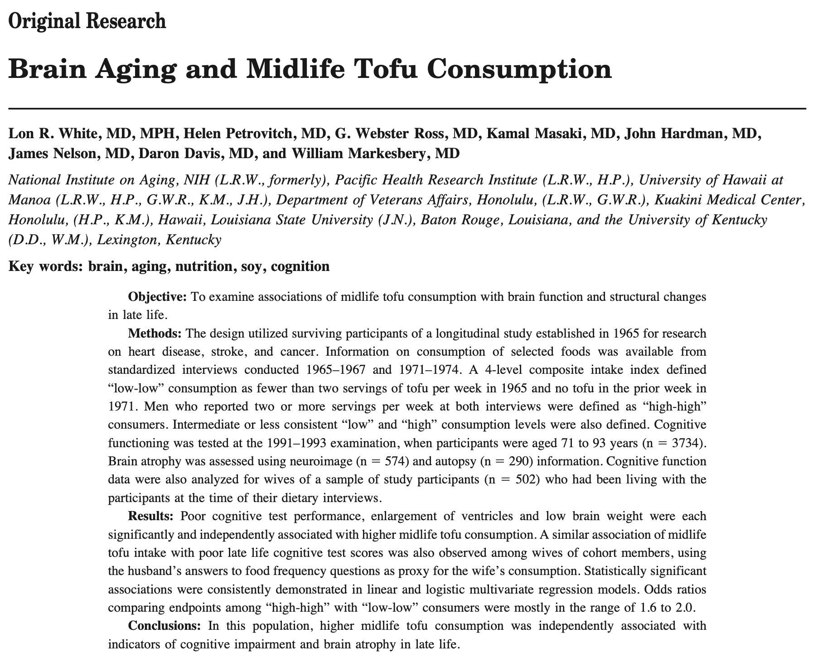

```{r load unit 04 packages, echo = FALSE, message = FALSE}
library(data.table)
library(ggplot2)
library(patchwork)

theme_set(theme_minimal())

knitr::knit_engines$set(notes = function(options) {
  code <- paste(options$code, collapse = "\n")
})
```


# Blocking and Clustering

When assigning treatment to units, unless there are restrictions created by the researcher, any of the treatment assignment vectors are equally probable. Blocking and clustering are ways of restricting the treatment assignments to a subset of the whole schedule of possibilities. 

*Blocking* is a method of creating "blocks", or groups, of units that are similar along one or more dimensions and then creating a full random assignment within each of those similar groups. Through careful design, blocking can generate power or nuance for an experiment without any extra marginal costs for paying for additional units of treatment. 

*Clustering* is a circumstance that arises from a state of the world that *requires* you to assign several similar units to the same condition, be it treatment or control. Through careful design, clustering might not hamper the power of an experiment; though realizing the necessity of a clustered design is typically met with the following statement, "@#$%, we've got to cluster."  

## Learning Objectives 

At the end of this week, student will be able to 

1. **Recognize** when there is the potential to block random assign in their experiment, and **remember** why block random assignment beneficial. 
2. **Recognize** when they are required to cluster random assign -- either due to a pragmatic (i.e. real-world) limitation, or to avoid violating the requirement that units not interfere with one another -- and **identify** ways that they can mitigate the reduction-in-power that arises from the need to cluster.
3. **Distinguish** between the circumstances that lead to blocking and clustering. 
4. **Analyze** both blocked and clustered experiments using the appropriate test, and generating statements of certainty and uncertainty using *randomization inference*. 

## Setting terms: Blocking

- What does it mean to block randomize? 
- Does the elimination of some randomization mean that the randomization is not longer, well, random? 
- Relative to when treatment is administered, when are we able to block? Why are we not able to block after we've assigned treatment? 

## Math: Block random assignment 

In equation 3.6 (on page 61) of *Field Experiments* Green and Gerber write, 

\[ 
  \widehat{SE} = \sqrt{\frac{\widehat{Var}(Y_{i}(0))}{N-m} + \frac{\widehat{Var}(Y_{i}(1))}{m}}
\]

When we block randomize, we're essentially creating smaller groups of units and producing an estimate of the variance within each of those smaller groups of units. 

How do the authors arrive at the following formula for a block randomized standard error? 

\[ 
  \widehat{SE}(\widehat{ATE}_{blocked}) = \sqrt{\sum_{j=1}^{J}\left(\frac{N_{j}}{N}\right)^2 * \widehat{SE}^2(\widehat{ATE}_{j})}
\]

- Specifically, why are we squaring the scaling parameter $\frac{N_{j}}{N}$? 
- If you look at this summation, what has to happen to the variance within the groups, relative to the size of the groups, in order for blocking to actually increase power? 
- Is it possible that you block, without increasing power, even if the blocking  variable is actually useful? 

Green and Gerber, in equation 3.10, write that the overall $ATE$ of the population is: 

\[ 
  ATE = \sum_{j=1}^{J} \frac{N_{j}}{N} ATE_{j}
\]

- What does this equation "feel like"? Does that seem reasonable? Why or why not? 
- Why might it be a good idea to have different rates of assignment to treatment within different blocks? Consider the following example: 

  - Suppose that you are looking at an experiment among your whole user base, and you are considering changing the "check out flow" (we have not idea what that might mean either...) for this group. 
  - Some of the users are *really* likely to purchase, while others are very unlikely to purchase. 
  - Does it make sense to block randomize based on this prior purchase history?
  - Are there any, reasonable business reasons to not make the treatment assignments be 50% treatment and 50% control in both of the populations? 
  - What would happen if you randomized 10% of the "high value" customers into treatment and 50% of the low value customers into treatment. But, then you forget (or lost) that table of whether they were "high" or "low" value customers. 
  - *What would be the consequence to your treatment effect estimate?*

## Intuition: Block Random Assignment 

To discuss the idea of blocking, consider the working example that David and David present in the async lectures: 

> Eating too much tofu (aka the *Berkeley diet*) might increase decrease one's brain function, leading to decreased performance on cognitive tests, lower brain weight, and cause ventrical enlargment of the brain. 
> 
> Don't ask your instructors what any of that medical jargon might mean. It isn't our field! But, these are real claims made by a group of researchers in an observational nutrition study titled "Brain Aging and Midlife Tofu Consumption." 



Suppose that, motivated by your distaste for bunk, casual causal claims about diet, and taste for tofu, you decide to conduct a real experiment among your friends, families, and classmates to determine the actual impacts of tofu on diet. 

```{r write simulation function}
set.seed(1414)

sim_normal_study <- function(treatment_effect=0) {
  ## this function will create a "world" to analyze using an experiment, 
  ## then, it will estimate the ate within that world 
  ## it returns the ate and the number of women who are in treatment 
  
  require(data.table)
  
  d <- data.table(
      group        = rep(c('M', 'F'), each = 20), 
      po_control   = c(1:20, 81:100), 
        ## treatment_effect = 0 --> sharp null is true
      po_treatment = c(1:20, 81:100) + treatment_effect, 
      treatment = sample(1:0, size = 40, replace = TRUE))[ , ## notice we're now assigning
      outcomes := po_treatment * treatment + po_control * (1 - treatment)]

  ate <- d[ , mean(outcomes[treatment == 1]) - mean(outcomes[treatment == 0])]
  n_women_treatment = d[treatment == 1 & group == 'F', .N]

  return(list(
    data = d,
    ate = ate, 
    n_women_treatment = n_women_treatment
    ))
}
```

## With this data, what does the distribution of outcomes look like?

```{r run study once}
experiment_one <- sim_normal_study(treatment_effect = 0)
experiment_two <- sim_normal_study(treatment_effect = 10)
```

 

```{r}
experiment_one_plot <- ggplot(data = experiment_one$data) + 
  aes(x = outcomes, fill = factor(treatment), linetype = group) + 
  geom_density(alpha = 0.5) + 
  labs(title = 'No effect'
  )
experiment_two_plot <- ggplot(data = experiment_two$data) + 
  aes(x = outcomes, fill = factor(treatment), linetype = group) + 
  geom_density(alpha = 0.5) + 
  labs(title = 'Ten unit effect'
  )

(experiment_one_plot / experiment_two_plot) + 
  plot_annotation(title = 'Measured Distribution of Estrogen, by Group') + 
  plot_layout(guides = 'collect')
```

In these two different cases -- where there is no treatment effect on top, and when there is a large treatment effect on bottom --  what are the group means? Where would they be on these plots? 

Consider the formula for the SE_{ATE}. 

\[
  SE(\tau) \approx \sqrt{\frac{V[\tau]}{N}}
\]

The important parts to consider for this discussion (despite being not a full statement of the SE) is that the standard error of the difference of group averages is a ratio of the underlying variance of the treatment effect, divided by the number of observations in that group.

\[
  \begin{aligned}
  SE[\tau] & \approx \sqrt{\frac{V[Y(1)]}{n_{1}} + \frac{V[Y(0)]}{n_{0}}} \\ 
           & \approx \sqrt{\frac{E[\left(Y(1) - E[Y(1)]\right)^2]}{n_{1}} + \frac{E[\left(Y(0) - E[Y(0)]\right)^2]}{n_{0}}}
  \end{aligned}
\]

- When you examine the plot above, what are the expected values of the treatment and control groups? 
- What does the expected value of the square of the deviations look like on this plot?

<!--
\[ 
  \sqrt{
  \frac{1}{k-1} 
    \left\{
      \frac{m*Var(\overline{Y_{j}}(0))}{N-m} + \frac{(N-m)Var(\overline{Y_{j}}(1))}{m} +
        2 * Cov(\overline{Y_{j}}(0),\overline{Y_{j}}(1))
      \right
    \}
  } 
\]
-->

## Technical Benefits of Blocking 

How how does breaking this population into two smaller groups create a reduction in the calculated standard error that you observe from an experiment? 

- What is (draw) the conditional expectation among the `M` group and the `F` group. 
- What is (draw) the conditional variance among the `M` group and the `F` group. 
- How has this change produced a reduction in the overall variance? 

```{r}
experiment_one_plot <- ggplot(data = experiment_one$data) + 
  aes(x = outcomes, fill = factor(treatment), linetype = group) + 
  geom_density(alpha = 0.5) + 
  labs(title = 'No effect'
  )
experiment_two_plot <- ggplot(data = experiment_two$data) + 
  aes(x = outcomes, fill = factor(treatment), linetype = group) + 
  geom_density(alpha = 0.5) + 
  labs(title = 'Ten unit effect'
  )

(experiment_one_plot / experiment_two_plot) + 
  plot_annotation(title = 'Measured Distribution of Estrogen, by Group') + 
  plot_layout(guides = 'collect')
```

## How should we block randomize?

Let's take several discussion points, in order: 

### What makes a useful feature? (part 1)

- When we are considering a block randomization to improve the *power* of a test, what about a feature makes it a useful blocking feature? (For instructors, probably don't read each of these, but try to get the discussion to address them.)

  - Does a good blocking feature have to be associated with the treatment? 
  - Does a good blocking feature have to be associated with potential outcomes? 
  - Does a good blocking feature have to have a causal effect on the measured outcomes?

- Suppose that have two possible features that you could use to block in the estrogen experiment. Either, you can block randomize using: 

  (a) blood-serum levels of estrogen, measured a week before the experiment begins; or (
  b) "stated form" sex (i.e. female, male, nonbinary). 

### What makes a useful feature (part 2)

- In the async, and to this point in this live session, we have spoken only about features that are categorical for blocking. 
- Is it possible to block on a continuous feature? 

  - What if it were measured very, very precisely, so every unit had a unique value on a continuous variable?
  - If you *could* develop a method of blocking on a continuous variable, what might be the benefits? 
  
### Strategies of blocking 

- If there is a benefit of creating two mini-experiments through blocking -- as you have proposed in the code above -- could there be a benefit to creating a third mini-experiment through blocking? What about a fourth? Is there a limit that you run into?

  - What is the most blocks that you can produce in an experiment? 
  - Or, alternatively, what is the smallest size block that you can produce in an experiment?
  - Is there a reason to take this strategy? 
  - What if you created many blocks, but with a noisy blocking feature. Would this work well? 
  - What if you created many blocks, but with a very precise blocking feature. Would this work well? 
  
- To this point, we have discussed blocking on only a single variable. Is it possible to block on more than one variable at a time? 

  - If you have already blocked on one variable, what are the characteristics that are useful for the next variable that you consider blocking on? 
  - For example, suppose that you have already blocked the tofu experiment on experimental units' stated-form sex. Would it be useful to then block based on wearing glasses, or hair length, or blood-serum estrogen? Why or why not? 
  
## Clustering 

- What are the circumstances in the world that make it necessary to cluster random assign? 
- Are these circumstances academic? Or, are there actually examples of where this might come into play? 
  - Consider the ride sharing example that we read about in *Power of Experiments*. What would happen if we gave some people really low prices to get into a rideshare, while we gave other people really high prices? What if they are standing next to eachother at the airport? What if one is at an airport in Oakland, while the other is at SFO? 
  
## Blocking or Clustering? 

### Let is snow! 
Suppose we want to measure the effect of snowplowing on local retail activity.  We design an experiment that plows some locations but not others. Which of the following do you prefer? Explain the relative advantages and disadvantages of each option.

  - On a given street, we randomly assign which businesses we plow in front of.
  - We randomly assign which streets to plow and which streets not to plow.
  - We randomly assign which neighborhoods to plow and which neighborhoods not to plow.
  - Do the differences above illustrate blocking, or clustering?

Returning to the snowplow example, suppose we have two wealthy neighborhoods, nine middle-class neighborhoods, and four poor neighborhoods available to experiment on.  We are worried that if we put both of the wealthy neighborhoods into the treatment group, we will get an overestimate of the treatment effect of snowplowing on retail activity.
We will assign treatment at the neighborhood level.  Now consider blocking this experiment based on social class.  Describe treatment assignment for the fifteen neighborhoods.

  - Does blocking reduce bias?
  - What benefit do we expect blocking to have on our ATE estimator?

### Strolling through Berkeley
David Reiley walks through Berkeley and observes retail shops.  As he goes, he takes each pair of stores he encounters, flips a coin, and goes into one store in each pair to give them a free Google ad coupon. He later observes how much each spent on Google ads in the month after.
  
  - Why might this increase power compared to picking stores totally at random?
  - Reiley does the same as above, but picks one store on every street only.
  - Reiley does the same as above, but picks two stores on every street only.
  - Reiley picks one side of each street to treat on many streets.

### Always low prices? 
Imagine that an executive at Walmart gives you the keys to the pricing at the store and asks you to determine how demand for goods changes depending on the pricing of those goods? Basically, does “rolling back prices” lead to increased demand? And by how much? 

- What are the different levels at which you could assign different prices? 
- What are the benefits and limitations of assigning different prices at those levels? 
