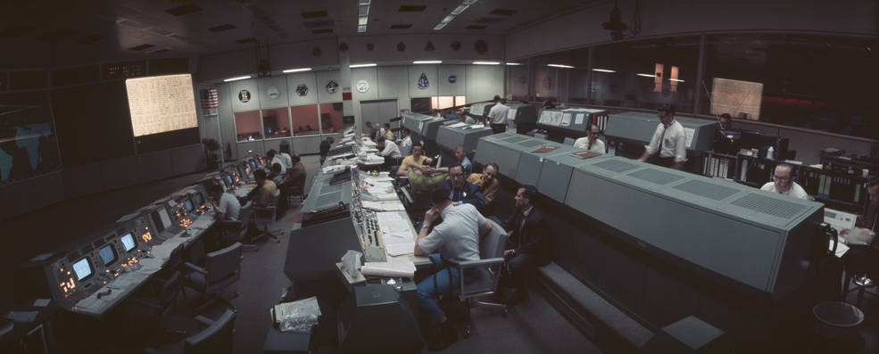

```{r load packages, eval=TRUE, echo=FALSE, message=FALSE}
library(data.table)
library(ggplot2) 
```

```{r set themes, echo=FALSE}
theme_set(theme_minimal())
```

# Live Session {-}

This is the live session work space for the course. Our goal with this repository, is that we're able to communicate *ahead of time* our aims for each week, and that you can prepare accordingly. 

